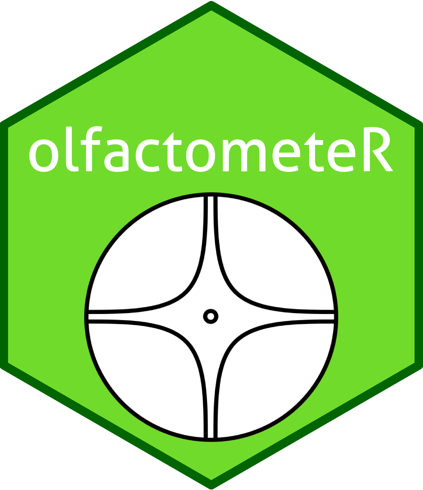

<!-- README.md is generated from README.Rmd. Please edit that file -->

```{r, include = FALSE}
knitr::opts_chunk$set(
  collapse = TRUE,
  comment = "#>",
  fig.path = "man/figures/README-",
  out.width = "100%"
)
```


# `olfactometeR` - Streamlined data collection for behavioural experiments using olfactometry

<!-- badges: start -->
[](https://www.tidyverse.org/lifecycle/#experimental)
[](https://travis-ci.org/Dr-Joe-Roberts/olfactometeR)
<!-- badges: end -->

`olfactometeR` provides interactive, easy to use functions that facilitate data collection for experiments using olfactometers to test behavioural responses of test subjects to volatile chemical stimuli. This package is largely written for undergraduate students and entomology researchers in the [Bruce Lab at Keele University](https://www.keele.ac.uk/lifesci/ourpeople/tobybruce/#research-and-scholarship) to replace outdated software programmes that do not run on modern operating systems, but may be useful for other researchers.

**DISCLAIMER:** `olfactometeR` is under active development and not all features are optimised or available at present. 

## Installation

You can install the development version of olfactometeR from [GitHub](https://github.com/) with:

``` r
# install.packages("devtools")
devtools::install_github("Dr-Joe-Roberts/olfactometeR")
```

## Using `olfactometeR`

> Until a more stable release of `olfactometeR` is released please fork this repo and use your version for stability. Changes made here are likely to be sporadic but drastic. Otherwise, use this repo at your own discression! 

Currently there are two functions available for data collection, which allow the user to interact with the console to record the behavioural response of their study subject. 

#### 1. `record_four_arm()` for experiments using four-arm olfactometers

Four-arm olfactometers are conventionally split into five zones, one for each arm as well as a central zone, with each zone corresponding to a numerical key `1:5`. When a study subject leaves a zone, the user must use the numerical key corresponding to the departed zone to ensure the correct zone is recorded. When the observation period has finished, the user can end the recording process by pressing `t`, which will display a summary results table in the console. At present the `record_four_arm()` function is able to accomodate up to two treatment arms.

Four-arm olfactometer with one treatment arm example:

```
# One treatment arm

library(olfactometeR)

record_four_arm()

User initials: JR
Year: 2019
Experiment number: 1
Replicate number: 1
Number of treatment arms (1/2): 1
Olfactometer arm containing treatment (1/2/3/4): 2
Press any key to begin collecting data:
Olfactometer zone: 5
98.08 sec elapsed
Olfactometer zone: 4
25.61 sec elapsed
Olfactometer zone: 2
106.95 sec elapsed
Olfactometer zone: 4
3.57 sec elapsed
Olfactometer zone: 2
11.85 sec elapsed
Olfactometer zone: 5
11.37 sec elapsed
Olfactometer zone: 3
55.02 sec elapsed
Olfactometer zone: 2
11.72 sec elapsed
Olfactometer zone: t


|Olfactometer Zone|Time in Zone (secs)|Time in Zone (mins)|No. Times Zone Entered|Treatment Arm|
|:---------------:|:-----------------:|:-----------------:|:--------------------:|:-----------:|
|        1        |        0.00       |       0.00        |          0           |             |
|        2        |      130.52       |       2.18        |          3           |      T      |
|        3        |       55.02       |       0.92        |          1           |             |
|        4        |       29.18       |       0.49        |          2           |             |
|        5        |      109.45       |       1.82        |          2           |             |
```

#### 2. `record_y_tube()` for experiments using Y-tube olfactometers

Each of the two Y-tube olfactometer arm corresponds to a numerical key, `1` or `2`. When a study subject enters one of the olfactometer arms and crosses the pre-determined line to indicate a decision has been made the user must use the corresponding numerical key to record the individual as having made a choice. Recording will automatically end once a choice has been made and entered into the console, which will display a summary results table in the console.

Y-tube olfactometer example:

```
library(olfactometeR)

record_y_tube()

User initials: JR
Year: 2019
Experiment number: 1
Replicate number: 1
Olfactometer arm containing treatment: 2
Press any key to begin recording data:
Olfactometer zone: 1
99.97 sec elapsed


|Olfactometer Arm|Time to Reach Arm End (secs)|Time to Reach Arm End (mins)|Treatment Arm|
|:--------------:|:--------------------------:|:--------------------------:|:-----------:|
|        1       |            99.97           |             1.67           |             |
|        2       |              NA            |              NA            |      T      |
```

## The future :crystal_ball:

There are a number of features I intend to develop for `olfactometeR` to help streamline data analysis and visualisation for behavioural experiments using olfactometry. If you have any feature suggestions or if you discover any issues please report them! 
