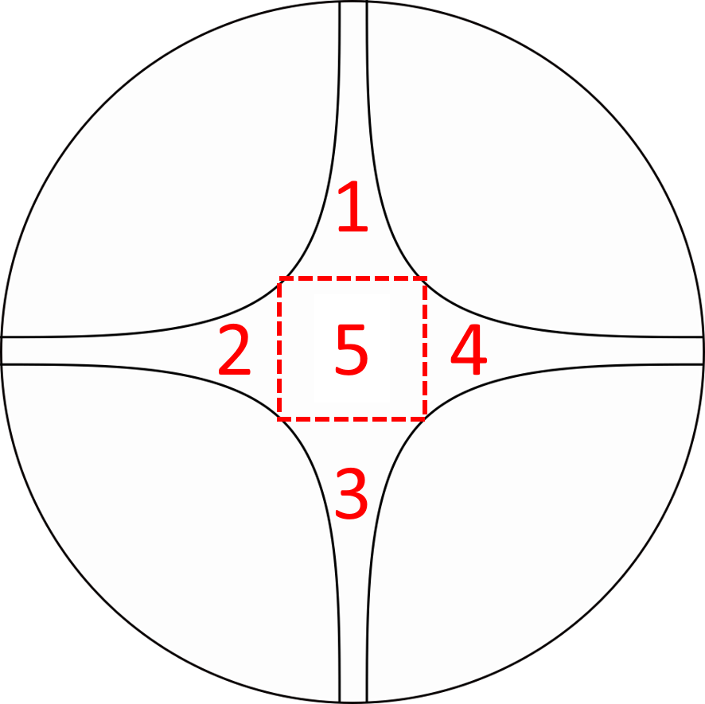

<!-- README.md is generated from README.Rmd. Please edit that file -->


# olfactometeR - Streamlined data acquisition and analysis for olfactometer experiments

<!-- badges: start -->

<!-- badges: end -->

The olfactometeR package provides various features that optimise
olfactometer experiments from data acquisition to visualisation and
analysis. This package was largely written for personal use, but as the
currently available software programmes for olfactometer experiments are
either expensive or outdated and due to the absence of an existing R
package it has made publically available.

*DISCLAIMER: olfactometeR is currently under active development and not
all features are optimised or available at present.*

## Installation

You can install the development version of olfactometeR from
[GitHub](https://github.com/) with:

``` r
# install.packages("devtools")
devtools::install_github("Dr-Joe-Roberts/olfactometeR")
```

## Usage

Currently there are two primary functions that facilitate data
acquisition from four-arm olfactometer experiments where there is only
**one** treatment arm. Further olfactometer designs and functions are in
development. The two functions available are:

  - `record_data()` for data acquisition
  - `results_table()` for viewing a summary results table in the console
    and exporting results as a .xlsx file

Executing the `record_data()` function will prompt the user to input the
following information:

  - User initials
  - Year
  - Experiment number
  - Replicate number
  - Olfactometer arm containing treatment

Once these details have been supplied the user will be prompted to press
‘s’ to begin recording data. Data acquisition requires the user to press
the number key corresponding to the olfactometer zone that the test
subject was in once it leaves that zone - number keys 1 to 5 are valid
for olfactometer zones. To end data acquisition, the user must press ‘t’
to terminate data acquisition.

<p align="center">



## Examples

Below is a basic data acquisition example:

    record_data()
    
    User initials: JR
    Year: 2019
    Experiment number: 1
    Replicate number: 1
    Olfactometer arm containing treatment: 2
    Press s to begin recording data: s
    Olfactometer zone: 4
    13.7 sec elapsed
    Olfactometer zone: 2
    6.19 sec elapsed
    Olfactometer zone: 5
    6.61 sec elapsed
    Olfactometer zone: 2
    45.67 sec elapsed
    Olfactometer zone: t

## Example

This is a basic example which shows you how to solve a common problem:

``` r
library(olfactometeR)
## basic example code
```

What is special about using `README.Rmd` instead of just `README.md`?
You can include R chunks like so:

``` r
summary(cars)
#>      speed           dist       
#>  Min.   : 4.0   Min.   :  2.00  
#>  1st Qu.:12.0   1st Qu.: 26.00  
#>  Median :15.0   Median : 36.00  
#>  Mean   :15.4   Mean   : 42.98  
#>  3rd Qu.:19.0   3rd Qu.: 56.00  
#>  Max.   :25.0   Max.   :120.00
```

You’ll still need to render `README.Rmd` regularly, to keep `README.md`
up-to-date.

You can also embed plots, for example:


In that case, don’t forget to commit and push the resulting figure
files, so they display on GitHub\!
